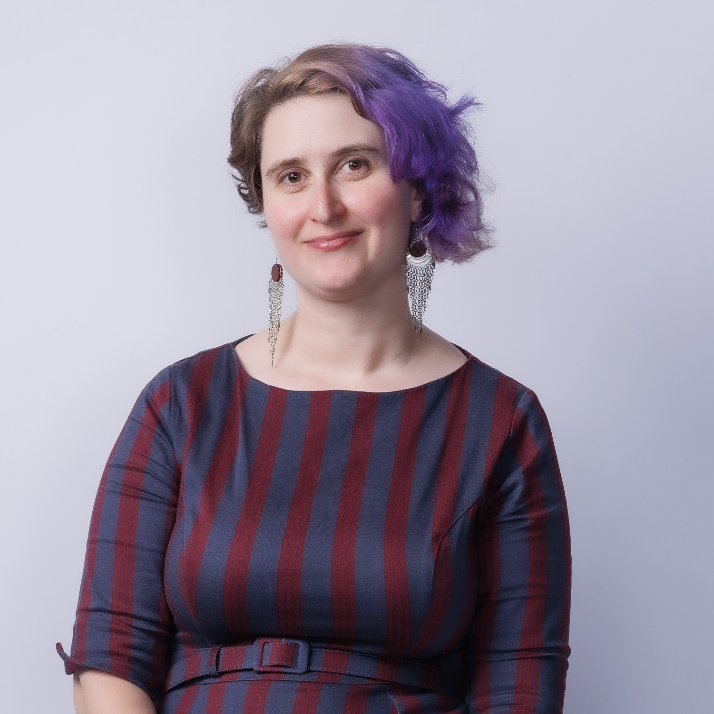
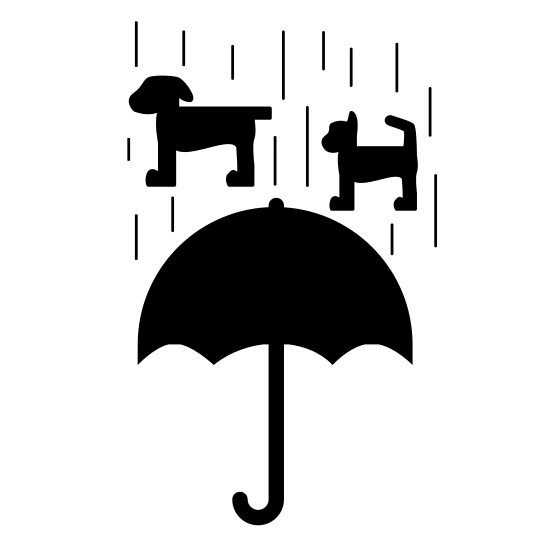
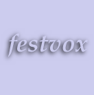

<!-- https://www.free-css.com/free-css-templates/page278/freefolio -->

<!--TOC skip from https://www.aleksandrhovhannisyan.com/blog/jekyll-table-of-contents/-->

    <a href="#home" class="screen-reader-only" aria-label="skip navigation">Skip navigation</a>

	

<!-- Navbar Start -->
<nav class="navbar fixed-top shadow-sm navbar-expand-lg bg-light navbar-light py-3 py-lg-0 px-lg-5">
<a href="index.html" class="navbar-brand ml-lg-3">
    <h1 class="m-0 display-5">Lara J. Martin</h1>
</a>
<button type="button" class="navbar-toggler" data-toggle="collapse" data-target="#navbarCollapse">
    
</button>

    

        <a href="#home" class="nav-item nav-link active">Home</a>
        <a href="#news" class="nav-item nav-link">News</a>
        <a href="#contact" class="nav-item nav-link">Contact</a>
        <a href="#research" class="nav-item nav-link">Research Accounts</a>
        <a href="/lab" class="nav-item nav-link">LARA Lab</a>
	<a href="/LaTeSS" class="nav-item nav-link">LaTeSS (Seminar)</a>
        <a href="#bio" class="nav-item nav-link">Bio</a>
        <a href="/lab/publications" class="nav-item nav-link">Publications</a>
        <a href="#teaching" class="nav-item nav-link">Teaching</a>
        <a href="#media" class="nav-item nav-link">Media</a>
        <a href="#talks" class="nav-item nav-link">Talks</a>
        <a href="#blog" class="nav-item nav-link">Blog</a>
        <a href="#random" class="nav-item nav-link">Fun Facts</a>
    

</nav>
<!-- Navbar End -->

<!-- Header Start -->

    

        

            
        

        

            <h1 class="display-3 text-uppercase text-primary mb-2 name-header">Lara J. Martin, PhD</h1>

            
           
            <h2 class="d-inline font-weight-lighter text-white">
            Assistant Professor at the   <a href="https://www.csee.umbc.edu/" aria-label="UMBC's Computer Science and Electrical Engineering department">University of Maryland, Baltimore County</a></h2>
             
            <h1 class="typed-text-output d-inline font-weight-lighter text-white"></h1>
            
Human-Centered AI, Applied NLP, Neurosymbolic Methods, Automated Story Generation, AAC, Dungeons and Dragons AI

            <h1 class="d-inline font-weight-lighter text-white post-typed"> Researcher</h1>
            
        <h5 style="text-transform:none;"><a href="http://ipa-reader.xyz/?text=l%C9%91%C9%B9.%C9%99&voice=Joanna" aria-label="hear how Lara is said">How to say Lara <i class="fa-solid fa-volume-high"></i></a></h5>
        I make systems that improve how people talk <em>with</em> computers and to each other <em>through</em> computers.
        Most of my career so far has been teaching computers how to tell stories (also known as automated story generation) and working my way towards an <a href="https://www.wired.com/story/forget-chess-real-challenge-teaching-ai-play-dandd/" aria-label="Wired article on Lara's work about teaching AI to play D\&D">AI Dungeon Master</a>.
        I am also currently working on <a href="https://arxiv.org/abs/2404.17730" aria-label="my AAC paper interviewing autistic adults">Augmentative and Alternative Communication (AAC)</a> and speech technologies.
	 
	I run the <a href="./lab/">LARA Lab</a> and am a member of the <a href="http://iral.cs.umbc.edu/">Interactive Robotics and Language Lab (IRAL)</a>. My pronouns are <a aria-label="How to use she/they pronouns" href="https://en.pronouns.page/she&they">she/they</a>.

		
            

             
                <a aria-label="Lara&#39;s CV" href="https://github.com/lara-martin/CV/raw/main/LaraMartinCV.pdf" class="btn btn-outline-light mr-5"> CV</a>
                
                <a aria-label="Lara&#39;s lab page" href="/lab" class="btn btn-outline-light mr-5"> LARA Lab</a>
                
                <a aria-label="Lara&#39;s UMBC page" href="https://www.csee.umbc.edu/lara-j-martin/ " class="btn btn-outline-light mr-5"> UMBC Personal Page</a>
                
                <a aria-label="interactive fiction and story generation resource list" href="/resources.html" class="btn btn-outline-light mr-5"> Interactive Fiction and Story Generation Resources</a>               
            

             
        

        
    

<!-- Header End -->

<!-- News Start -->

    <!-- News Section -->
	

		<h3 class="mb-4">News</h3>
		

		    <a href="#contact" class="screen-reader-only" aria-label="skip news">Skip news</a>
		
	
		<ul class="news">
			
			<li future-date="{{ news.date | date: '%Y%m%d' }}" style="background: rgb(194, 242, 182);"><strong>{{ news.date | date: '%-m/%-d/%Y' }} - {{ news.end | date: '%-m/%-d/%Y' }}</strong> - {{ news.text }}   &ndash; <em>{{news.location}}</em></li>				
										
		</ul>
	

	
<!-- News End -->

<!-- Contact Start -->

	
    

        

            <h3 class="mb-4">Contact</h3>
            

                    
<h6>Online <i class="fa-solid fa-globe" aria-label="globe icon"></i></h6>
                    <a rel="me" href="https://sigmoid.social/@laramar" aria-label="Mastodon"><i class="icon brands fa-mastodon">Mastodon</i></a>
                    <a aria-label="LinkedIn page" href="https://www.linkedin.com/in/lara-j-martin"><i class="icon brands fa-linkedin">LinkedIn</i></a>                   
                    <a aria-label="Twitter account" href="https://twitter.com/LangTechLara"><i class="icon brands fa-square-x-twitter">Twitter/X</i></a>
                    

                
<h6>Email <i class="fa fa-envelope" aria-label="email icon"></i> </h6>
                	
 
			  <noscript><i>Please enable Javascript to view</i></noscript>
			

			

                
<h6>In Person <i class="fa-solid fa-people-roof" aria-label="people under roof icon"></i> </h6>
			Information Technology and Engineering (ITE) Building, Room 216
			 
			1000 Hilltop Circle, Baltimore, MD 21250
		

		
            

        

       
       

        <h3 class="mb-4">Research Accounts</h3>
        

        		

			<h6>Google Scholar</h6> <a aria-label="Google Scholar" href="http://scholar.google.com/citations?user=YjiWURYAAAAJ"><i class="icon ai ai-google-scholar-square ai-2x">Google Scholar</i></a>
			

			

			<h6>Everything else</h6>
			<a aria-label="Github" href="https://github.com/lara-martin"><i class="icon fa-brands fa-square-github ai-2x">Github</i></a>
			<a aria-label="Research Gate" href="https://www.researchgate.net/profile/Lara_Martin7"><i class="icon ai ai-researchgate-square ai-2x">Research Gate</i></a>
			<a aria-label="Semantic Scholar" href="https://www.semanticscholar.org/author/Lara-J.-Martin/145262322"><i class="icon ai ai-semantic-scholar-square ai-2x">Semantic Scholar</i></a>
			<a aria-label="Academia.edu" href="https://umbc.academia.edu/LaraMartin"><i class="icon ai ai-academia-square ai-2x">Academia.edu</i></a>
			<a aria-label="ORCID ID" href="https://orcid.org/0000-0002-0623-599X"><i class="icon ai ai-orcid-square ai-2x">ORCID</i></a>
			<a aria-label="Web of Science" href="https://www.webofscience.com/wos/author/record/HII-3738-2022"><i class="icon ai ai-clarivate-square ai-2x">Web of Science</i></a>
			<a aria-label="dblp" href="https://dblp.uni-trier.de/pid/175/8906.html?q=Lara%20J.%20Martin"><i class="icon ai ai-dblp-square ai-2x">dblp</i></a>
			<a aria-label="arXiv" href="https://arxiv.org/a/martin_l_2.html"><i class="icon ai ai-arxiv-square ai-2x">arXiv</i></a>			
			<a aria-label="Scopus" href="https://www.scopus.com/authid/detail.uri?authorId=57225818647"><i class="icon ai ai-scopus-square ai-2x">Scopus</i></a>
			<!--<a aria-label="Papers with Code" href="https://paperswithcode.com/search?q=author%3ALara+J.+Martin"><i class="icon fa-solid fa-brackets-square"></i></a>-->
			<!--<a aria-label="Association for Computational Linguistics profile" href="https://aclanthology.org/people/l/lara-martin/">ACL</a>-->
			<!---->
			
			

	

	

	
        
        
    

<!-- Contact End -->

<!-- Bio Start -->

    

        <h1 class="display-1 text-uppercase text-white" style="-webkit-text-stroke: 1px #dee2e6;">Biography</h1>
        <h1 class="position-absolute text-uppercase text-primary">Biography</h1>
    

    
	
	
    

    

    <h3 class="mb-4">About Me</h3>
    My research interests include:
        

		

			
			<b>human-AI communication/collaboration</b>
			<ul>
				<li>computational creativity</li> 
				<li>interactive narrative</li>
				<li>narrative generation &amp; understanding</li>
				<li>dialog systems &amp; conversational agents</li>
				<li>cognitive systems</li>
			</ul>
		

		

			and <b>computer-mediated human-human communication</b>
			<ul>
				<li><a aria-label="augmentative alternative communication (AAC) description by ASHA" href="https://www.asha.org/public/speech/disorders/aac/">augmentative &amp; alternative communication (AAC)</a></li>
				<li>prosody &amp; emotion (affective computing)</li>
				<li>speech synthesis (text-to-speech)</li>
				<li>social media analysis</li>
			</ul>	
		

	

	
	I work from a blend of research and methods from various fields:
	<ul id="list">
		<li>natural language processing/language technologies,</li> 
		<li>linguistics,</li>
		<li>human-computer interaction,</li>
		<li>cognitive science,</li>
		<li>and artifical intelligence.</li>

	</ul>
	

	<!--
I am currently a <a aria-label="CI Fellows 2020 page" href="https://cifellows2020.org/">CIFellow</a> at the University of Pennsylvania, working with <a aria-label="Chris Callison-Burch" href="https://www.cis.upenn.edu/~ccb/">Dr. Chris Callison-Burch</a>. I earned my PhD in <a aria-label="HCC Program at Georgia Tech" href="https://www.cc.gatech.edu/degree-programs/phd-human-centered-computing">Human-Centered Computing</a> in the <a aria-label="School of Interactive Computing at Georgia Tech" href="https://www.ic.gatech.edu/">School of Interactive Computing</a> at the Georgia Institute of Technology. I worked with <a aria-label="Mark O. Riedl" href="http://eilab.gatech.edu/mark-riedl">Dr. Mark Riedl</a> in the <a aria-label="EI Lab" href="http://eilab.gatech.edu/">Entertainment Intelligence Lab</a>, doing automated story generation.
-->
	<!--
I have a Masters in Language Technologies from <a aria-label="Language Technologies Institute" href="https://www.lti.cs.cmu.edu/">LTI at Carnegie Mellon University</a> in their School of Computer Science. I received my BS in Computer Science and Linguistics from Rutgers University &mdash; New Brunswick.
-->
	
Some of my non-research passions include AI equity, science communication, and educating children about computer science and technology.

	
<a href="https://github.com/lara-martin/CV/raw/main/LaraMartinCV.pdf" aria-label="Lara's CV pdf">Check out my CV</a> for more information.

	
	            <h3 class="mb-4">Third-Person Bio</h3>
            
Dr. Lara J. Martin (she/they) is an assistant professor at the University of Maryland, Baltimore County in the CSEE department, researching human-centered artificial intelligence with a focus on natural language processing applications. They have worked in the areas of automated story generation, augmentative and alternative communication (AAC) tools, AI for tabletop roleplaying games, speech processing, and affective computing&mdash;publishing in top-tier conferences such as AAAI, ACL, EMNLP, and IJCAI.
            They have also been featured in <a href="https://www.wired.com/story/forget-chess-real-challenge-teaching-ai-play-dandd/" aria-text="wired article: Forget Chess—the Real Challenge Is Teaching AI to Play D&D">Wired</a> and <a href="https://www.sciencefocus.com/magazine/dark-stars/" aria-label="BBC Science Focus article: Alexa, tell me a story">BBC Science Focus magazine</a>.
             
             Previously, Dr. Martin was a 2020 Computing Innovation Fellow (<a aria-label="CI Fellows 2020 page" href="https://cifellows2020.org/">CIFellow</a>) postdoctoral researcher at the University of Pennsylvania working with Dr. Chris Callison-Burch. She earned her PhD in Human-Centered Computing from the Georgia Institute of Technology, where she worked with Dr. Mark Riedl. She also has a MS in Language Technologies from Carnegie Mellon University and a BS in Computer Science & Linguistics from Rutgers University—New Brunswick. 
             
             

        

    

<!-- Bio End -->

<!-- Teaching Start -->

    

        <h1 class="display-1 text-uppercase text-white" style="-webkit-text-stroke: 1px #dee2e6;">Teaching</h1>
        <h1 class="position-absolute text-uppercase text-primary">Teaching</h1>
    

    
I have a <a aria-label="Tech to Teaching" href="https://ctl.gatech.edu/tech-teaching">teaching certificate</a> from Georgia Tech, Summer 2018.

     
    

	
	
	

	<!--

 -->
	<h5 class="font-weight-bold mb-1"><a aria-label="{{ m.course }}" href="{{ m.link }}">{{ m.course }}</a> {{m.course}} </h5> <em>{{m.semester}}</em> {{ m.school}}  <small>{{m.note}}</small>

	

    

<!-- Teaching End -->

<!-- Media Start -->

    

        <h1 class="display-1 text-uppercase text-white" style="-webkit-text-stroke: 1px #dee2e6;">Media</h1>
        <h1 class="position-absolute text-uppercase text-primary">Media</h1>
    

    

	
	
	

	

 
	<em><a aria-label="{{ m.label }}" href="{{ m.link }}">{{ m.text }}</a></em> by {{ m.author }} for {{ m.publication }}. {{ m.date | date: "%b %e, %Y" }}.

	

    

<!-- Media End -->

<!-- Talks Start -->

    

        <h1 class="display-1 text-uppercase text-white" style="-webkit-text-stroke: 1px #dee2e6;">Talks</h1>
        <h1 class="position-absolute text-uppercase text-primary">Talks</h1>
    

    

    
        

		<h3>{{talk.date | date: '%-m/%-d/%Y'}} - {{talk.venue}}</h3>
		

			<iframe aria-label="{{talk.venue}}" src="{{talk.link}}" frameborder="0" allow="encrypted-media" allowfullscreen></iframe>
			

		

		 
		
		
		
        
 
           
    

<!-- Talks End -->

<!-- Blog Start -->

    

        <h1 class="display-1 text-uppercase text-white" style="-webkit-text-stroke: 1px #dee2e6;">Blog</h1>
        <h1 class="position-absolute text-uppercase text-primary">Blog</h1>
    

    

        
        
        

            

                
                

                    <h4 class="font-weight-bold mb-n1">{{post.date | date: '%d'}}</h4>
                    <small class="text-white text-uppercase">{{post.date | date: '%b'}}</small>
                

            

            <h5 class="font-weight-medium mb-4">{{post.title}}</h5>
            
            <h6 class="font-weight-medium mb-4">{{post.description}} &middot; {{ post.content | number_of_words }}{{ words | plus: 250 | divided_by: 250 | append: " minute read" }}</h6>
            
{{ post.content | strip_html | truncatewords: 15 }}
 
            <a class="btn btn-sm btn-outline-primary py-2" href="{{post.url}}">Read More</a>
        

	

 
    

<!-- Blog End -->

<!-- Fun Facts Start -->

    

        <h1 class="display-1 text-uppercase text-white" style="-webkit-text-stroke: 1px #dee2e6;">Fun Facts</h1>
        <h1 class="position-absolute text-uppercase text-primary">Fun Facts</h1>
    

    

        

            

                
			
			

                    <h4 class="font-weight-light mb-4">I have been collecting a list of American English <a aria-label="Idiom list" href="https://docs.google.com/spreadsheets/d/1hvuFG_Tg4IQIhMRMY1bZYV5yeJUUDb54W2QZWEHaL_U/edit?usp=sharing">idioms</a> for foreign friends.</h4>
                    
                

                

                    
                    <h4 class="font-weight-light mb-4">I created a machine translation system with Vivian Robison for translating the Bible from 
			<a aria-label="LOL speak to English Bible MT project" href="./poster/MT-project.pdf">LOLspeak to English</a>.</h4>
                    

                

                

                    
                    <h4 class="font-weight-light mb-4">I am a downloadable voice in the speech synthesis tool 
			<a aria-label="Festvox" href="http://www.festvox.org/flite/">Festvox</a> (voice "<a aria-label="LJM voice in Festvox (download)" href="http://www.festvox.org/flite/packed/flite-2.0/voices/cmu_us_ljm.flitevox">US English Female LJM</a>").</h4>
                

                

                
                  <h4 class="font-weight-light mb-4">I presented at 
			<a aria-label="SIGBOVIK 2015" href="http://sigbovik.org/2015/">SIGBOVIK 2015</a> (a fake conference) on "<a aria-label="Language Sequencing: Language as a Physical Entity slides" href="https://docs.google.com/presentation/d/1KRd6L_yGJgN6rNhW8EbOeNoDfRpnO4dMwptttT875jI/edit?usp=sharing">Language Sequencing: Language as a Physical Entity</a>" with 
			<a aria-label="Meghana Kshirsagar" href="https://www.cs.cmu.edu/~mkshirsa/">Meghana Kshirsagar</a>.</h4>
                    
                

            

        

    

<!-- Fun Facts End -->

